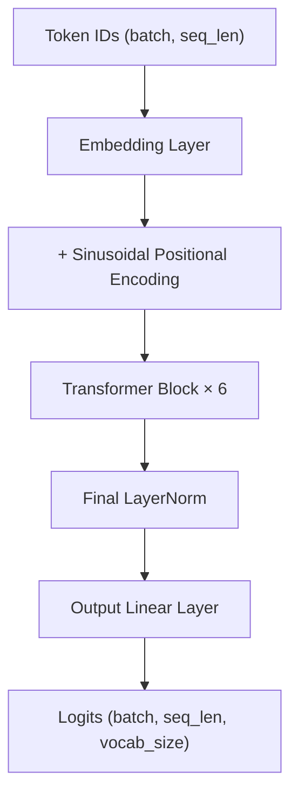
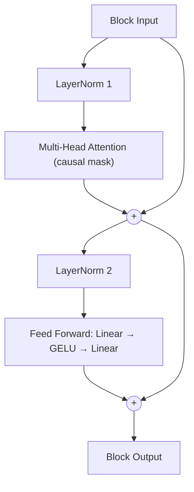

# LittleShakespeare - Pushed to its limits

[](https://opensource.org/licenses/MIT) [](https://www.python.org/downloads/release/python-31213/)

## Demo
Prompt: To be, or not to be:

holy mon.

SISABELLA:
So with were what Ifear.

ANGELO:
Ha good ct me finness that the wdyself.

ANGELO:
Whad to mustingman?

ISABELO:
SABELLA:
I hat.

ISABELLA:
So strum, my lords it dection.

ISABELLA:
Hay, sir.

ISABELLA:
Yought son
Thout ailkillain, you to your grave you your prant.

ISABELLA:
O, my lord.

ISABELLA:
I'll not your your good my lor,
ABELLA:
Ifear meancan it is your gray you your shand
That t.

ISABELLA:
ABELLA:
How?

ISABELLA:
O, Iness your your your it, thenerttainst good osonours to the father,
Witherrongumost be how,
Aladyryety,
To have you make it aba ed, as your hand
What you ves de't.

ISABELLA:
SABELLA:
O, that, by your your sa scuch so you dis'ty lord.

ISABELLA:
How it. Hay, sir; and band
ABELLA:
O, sir, th hall you leser blook liveven spper we thinke
Hows of the t's de donden swhat you leseech you
To have may father sper sheak you,
Nor it. Thanceit ink your your have sa mintter give your your sper
As ince to bbtrich your for your y,
Whent what I ds dench ark for your your your desscrany litlong as you ve.

LABELO:
ABELO:
GELLA:
How cantain,
As you hatold a genten, ter for for you.

ANGELO:
SABELO:
GELO:
Yous I much are a day.

ISABELLA:
Oratess, I'ter prove! it is your so lest
By you are you have madodisdy
BELO:
As could you not you speavengaintend
That you your fore you comen you,
Have you sotopartenty dogoo ttrand, I have sotwor your prave.

ISABELO:
I have no more to you me, sir, sir.

ANGELO:
ISABELLA:
We you your your hat.

ISABELLA:
ABELO:
We pitippivoy.

ISABELLA:
ABELO:
Who you your gention.

ANGELO:
We your your by you se; I have you your your gray.

ANGELLA:
O, sir, werviva wor to--morter you your your it will I
Wither your your your your your your gent.

ISABELO:
I know you
Whater to good you your it not be preving.

ISABELLA:
I'll you your headenator your sudence?

ISABELLA:
Ory you your dices; and you have not have ave, you.

ANGELO:
Thance to your sewere come, madeep

## Why This Project
This project is an attempt to optimise a small transformer trained on Shakespeare's works within strict hardware requirements. The hardware constraints are that the whole model must be trained and run inference on a Ryzen 7800x3d CPU, NVIDIA 4070 super GPU (12GB of VRAM) and 32GB of RAM. The goals of this project are: Increase generation accuracy; improve generation speed; and to learn how transformers and the systems around them work in detail. Implemented mostly from first principles using components from pytorch.

## Architecture
The architecture of the transformer:



The transformer blocks:



## Repo Structure

```
LittleShakespeare/
├── data/
│   └── LittleShakespeare.txt   # raw corpus; split 80/10/10 into train/val/test at runtime
├── models/
│   └── <n>/                    # one directory per training run, auto-incrementing
│       ├── model.pt            # checkpoint (weights + embedded config)
│       ├── config.json         # hyperparameter snapshot for this run
│       ├── training.log        # human-readable training log
│       ├── training_log.csv    # epoch, train_loss, val_loss
│       └── loss_curves_*.png   # linear + log-scale loss curves
├── vocabs/
│   └── <num_merges>.vocab      # cached BPE vocab + merge rules
├── config.py                   # every hyperparameter, as 4 dataclasses
├── preprocessing.py             # tokenizers (char-level + from-scratch BPE) and dataset chunking
├── model_components.py          # the transformer architecture
├── training.py                  # training loop, checkpointing, loss curve plotting
├── inference.py                 # autoregressive text generation (CLI)
├── main.py                      # training entry point
├── utils.py                     # checkpoint loading
└── test_preprocessing.py        # tokenizer sanity checks
```

A `src/`-based package layout, a proper test suite, and CI are planned — see Roadmap.

## Installation
Use the requirements.txt to install all the dependencies. You may need to visit pytorch's website to download a compatible version with your system.

## Usage

Train a new model — creates a new auto-incrementing `models/<id>/` run directory:
```bash
python main.py
```

Generate text from a trained checkpoint:
```bash
python inference.py --index <model_id> --prompt "To be, or not to be:"
```
Omit `--index` to use the highest-numbered (most recent) run in `models/`.

## Benchmarks

No formal evaluation harness exists yet — building one (held-out perplexity/bits-per-character, sample-quality comparisons under fixed decoding parameters, and training/inference tokens-per-sec) is the current focus of the project. In the meantime, here's where the two existing runs actually landed, read straight from their `training_log.csv`:

| Run | Tokenizer merges | d_model | Layers | Heads | Best Val Loss | Naive Val Perplexity¹ |
|---|---|---|---|---|---|---|
| 0 | 256 | 512 | 6 | 16 | 3.7505 (epoch 27) | ~42.5 |
| 1 | 256 | 512 | 6 | 16 | 3.7640 (epoch 24) | ~43.1 |

¹ `exp(val_loss)` — a naive perplexity, not yet the token-weighted version the evaluation harness will compute. Treat as directional, not final.

## Testing & CI

Run the tokenizer sanity check:
```bash
python test_preprocessing.py
```
This is currently the only test in the repo, and there's no CI pipeline yet — a real pytest suite and a GitHub Actions workflow (lint, type-check, test on every push) are planned next.

## Roadmap

Phases 1–5 are complete — every core component (data pipeline, tokenizer, embeddings/positional encoding, multi-head attention/feed-forward/transformer block, training loop, autoregressive sampling) was implemented from scratch.

**Current phase: Evaluation & Performance** — pushing this model as far as the hardware above allows:
- [ ] Objective evaluation — perplexity/bits-per-character, sample-quality A/B comparisons, a cross-run leaderboard
- [ ] Training performance — profiling, mixed precision tuning, fused optimizer, attention kernel choice
- [ ] Inference performance — KV caching (currently absent — every generated token recomputes the full forward pass), throughput benchmarking
- [ ] Profiling-driven optimization throughout, instead of guessing

Also planned: a `src/`-based package layout, a real pytest suite, CI, and eventually fine-tuning experiments.

## License
MIT license as seen in [License](/LICENSE)